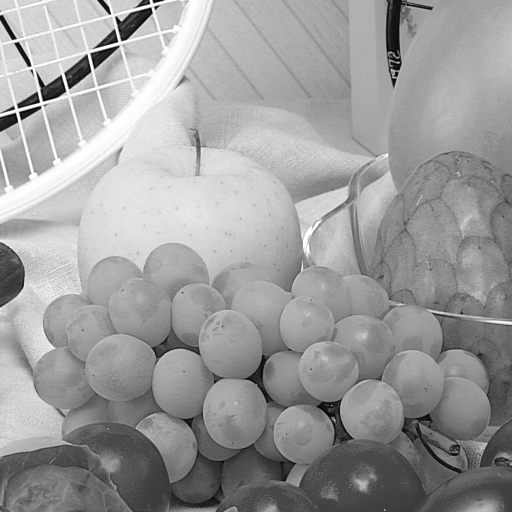
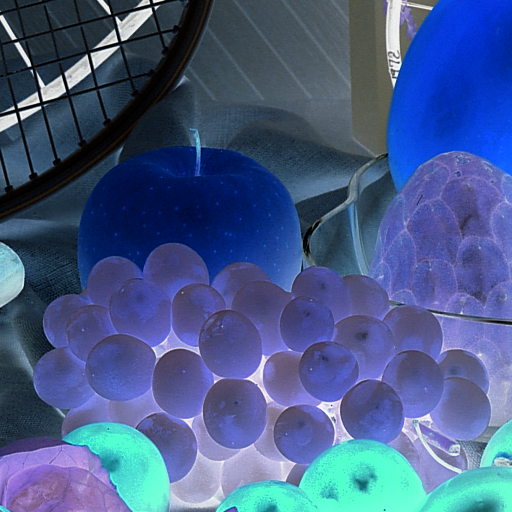
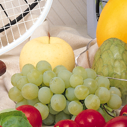
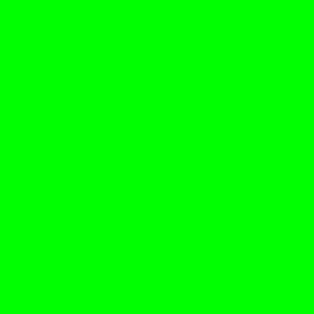
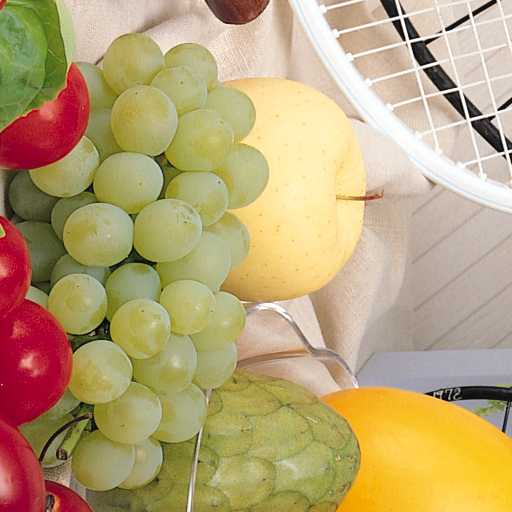
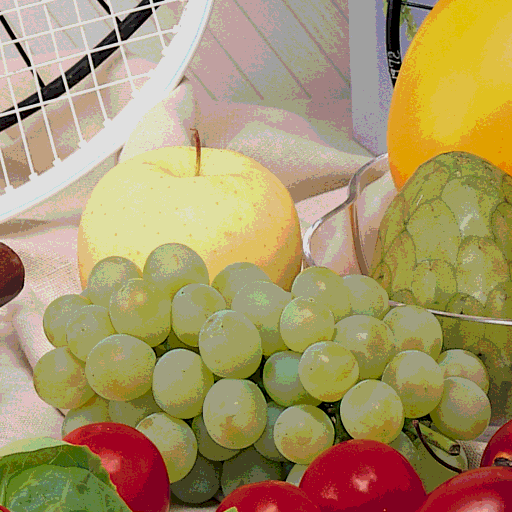
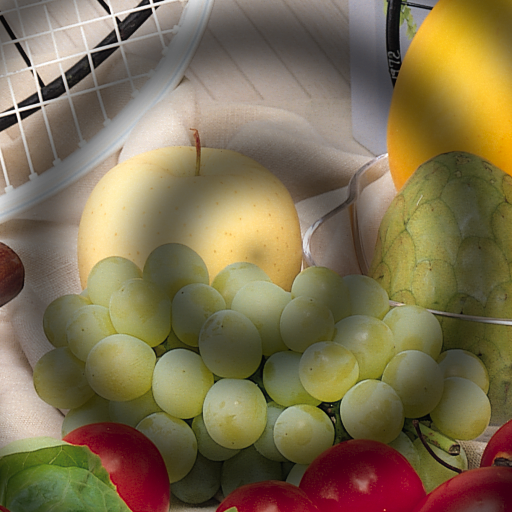
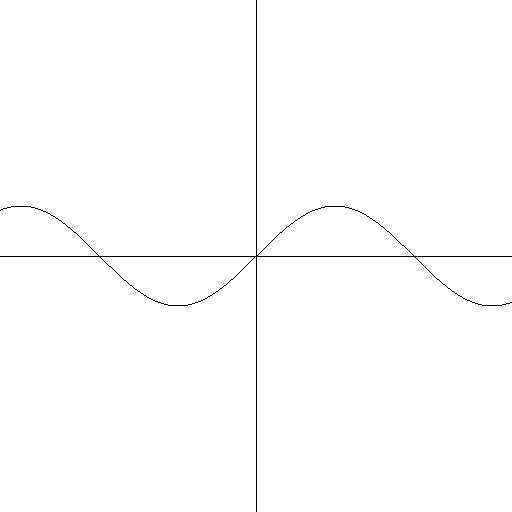
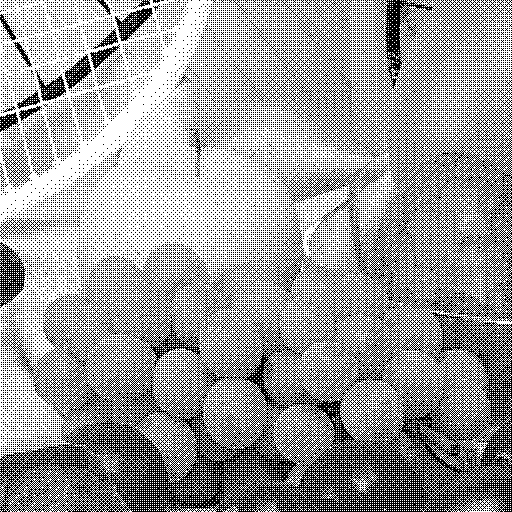

# Image-O-Matic
A C project to manipulate PNG images using the [lodepng](https://lodev.org/lodepng/) library

To run it, download the repo and run `make` inside the directory. Afterwards, run `./Imageomatic`.

## Commands

- `A` or `B` followed by file name, loads an image into register `A` or `B` respectively
- `+ <filename>` writes the image in register `A` to a new file with name `<filname>`
- `C` copies the content of register `B` to register `A`
- `Z` terminates the program
- `Q` turn the image to grayscale. Only for register `A`

- `N` turns the iamge to a negative image. Only for register `A`

- `H` scales the image to half its original size. Only for register `A`

- `P <color> <width> <height>` creates a new image with just the color `<color>`. `<color>` can be hexadecimal or a name of a color inside `cores.txt`. The image is saved in register `A`

- `R` rotates the image in register `A`

- `O` posterizes the image (reduced color pallete). Only for register `A`

- `G <width> <height>` creates a image simulating the waves created by a drop of water. Saved in register `A`

- `D` blurs the image in register `A`. This is not gaussian blur.

- `M` places a mask onto the image saved in register `A`. The mask is saved in register `B`. The mask and the image must have the same size.

- `F <width> <height> <scale>` creates an image with a graph representation of a function. Saves in register `A`

- `T` converts an image using a dithering algorithm. Only for register `A`

- `E` conceals a message into the image in register `A`, also known as steganography. It uses 6-bit ASCII tables to store the text in the two least-significant bits of the R, G and B components of the image.
